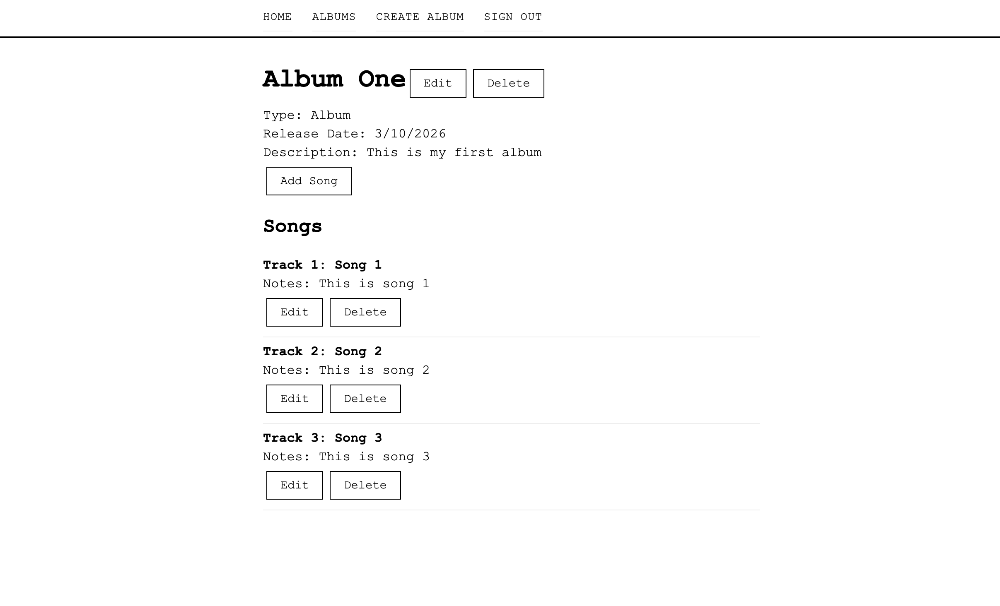

# Album Tracker

A React app for tracking your music albums and songs. Create an account, log your albums and EPs, and build out tracklists with notes for each song.



## Getting Started

- **Deployed app:** [sam-album-tracker.netlify.app](https://sam-album-tracker.netlify.app/)
- **Planning board:** [Trello](https://trello.com/invite/b/69a5b72e9fc61971e93ec70a/ATTIf487054d5c2af36e9ee3d467f502a00b127BD2AA/albummaker)
- **Back-end repository:** [github.com/samldahl/backend-albumtracker](https://github.com/samldahl/backend-albumtracker)
- 

## Technologies Used

- MongoDB
- Express
- React 19
- Node.js
- React Router
- Vite
- JWT authentication
- Netlify (deployment)

## Next Steps

- Improve CSS and overall UX for a better mobile experience

## Local Setup

1. Clone the repo and install dependencies:
   ```bash
   npm install
   ```

2. Create a `.env` file in the root with your backend URL:
   ```
   VITE_BACK_END_SERVER_URL=http://localhost:3001
   ```

3. Start the dev server:
   ```bash
   npm run dev
   ```
